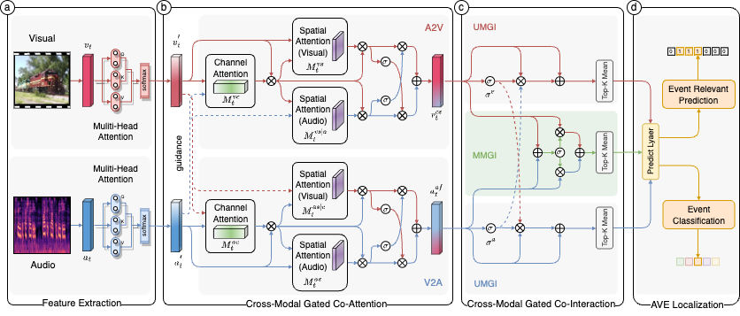

# Modality-Aware Gated Attention Network for Audio-Visual Event Localization


This is a pytorch implementation for paper "Modality-Aware Gated Attention Network for Audio-Visual Event Localization".

## Introduction
Audio-visual event localization (AVEL) refers to identifying the category and the corresponding temporal boundary of an event that is both visually and audibly discernible in unconstrained videos. Existing approaches, primarily relying on audio-guided visual attention, ignore the potential of visual to focalize audio and neglect the intrinsic modality biases for discrepant events. In this paper, we propose a novel Modality-Aware Gated Attention Network (MAGAN), aiming at improving the localization performance by attending to event-relevant visual regions, consolidating informative audio frequency, and capturing event-specific modality biases. Specifically, a cross-modal gated co-attention (CMGCA) scheme is presented to explore the channel-level and spatial-level event clues through two symmetrical gated components, i.e., audio-to-visual attention and visual-to-audio attention. Furthermore, a cross-modal gated co-interaction (CMGCI) mechanism, incorporating both unimodal gated interaction and multimodal gated interaction, is introduced to capture the event-specific modality biases by considering the unimodal independence and the multimodal synergy simultaneously. Moreover, an event-aware gate loss is devised to encourage the network to catch event-relevant information. Extensive experiments conducted on the AVE dataset comprehensively demonstrate the superiority and effectiveness of the proposed model over state-of-the-art approaches across both fully- and weakly-supervised AVE settings. 


> An overview of proposed modality-aware gated attention network (MAGAN). Firstly, multi-head attention is utilized to further refine audio and visual features. Then, the cross-modal gated co-attention (CMGCA) module uses mutual guidance to obtain the channel-level and spatial-level attention. Finally, the cross-modal gated co-interaction (CMGCI) mechanism incorporates unimodal gate and multimodal gate to capture the modality biases for specific events.

## Prerequisites

This package has the following requirements:

* `Python 3.7.16`
* `Pytorch 1.13.1+cu117`
* `CUDA 12.3`
* `Numpy 1.21.6`


## Data preparation
The VGG visual features can be downloaded from [Visual_feature](https://drive.google.com/file/d/1hQwbhutA3fQturduRnHMyfRqdrRHgmC9/view?usp=sharing).

The VGG-like audio features can be downloaded from [Audio_feature](https://drive.google.com/file/d/1F6p4BAOY-i0fDXUOhG7xHuw_fnO5exBS/view?usp=sharing).

The noisy visual features used for weakly-supervised setting can be downloaded from [Noisy_visual_feature](https://drive.google.com/file/d/1I3OtOHJ8G1-v5G2dHIGCfevHQPn-QyLh/view?usp=sharing).

After downloading the features, please place them into the `data` folder.

If you are interested in the AVE raw videos, please refer to this [repo](https://drive.google.com/open?id=1FjKwe79e0u96vdjIVwfRQ1V6SoDHe7kK) and download the AVE dataset. 

## Training and Evaluating MAGAN

### Fully-Supervised Setting
The `configs/main.json` contains the main hyperparameters used for fully-supervised training.

Training 
```bash
python supv_main.py --gpu 0 --lr 1e-4 --clip_gradient 0.5  --n_epoch 200 --b 64 --test_batch_size 16 --print_freq 1 --snapshot_pref "./Exps/Supv/xxxxx/"
```
Evaluating

```bash
python supv_main.py --gpu 0 --evaluate --print_freq 1 --resume "./Exps/Supv/Supervised_model.pth.tar"
```
### Weakly-Supervised Setting
The `configs/weak.json` contains the main hyperparameters used for weakly-supervised training.

Training 
```bash
python weakly_main.py --gpu 0 --lr 0.0006 --b 128 --clip_gradient 0.5 --test_batch_size 16 --n_epoch 200 --snapshot_pref "./Exps/WeaklySupv/xxxx/"
```
Evaluating

```bash
python weakly_main.py --gpu 0 --evaluate --print_freq 1  --resume "./Exps/WeaklySupv/WeaklySupervised_model.pth.tar"
```

## Pretrained model
The pretrained models can be downloaded from [Supervised_model](https://drive.google.com/file/d/1PjJC13edvwz8dTjsZs9MuPtCM8t4bogI/view?usp=sharing)
 and [WeaklySupervised_model](https://drive.google.com/file/d/1PjJC13edvwz8dTjsZs9MuPtCM8t4bogI/view?usp=drive_link).

After downloading the pretrained models, please place them into the `Exps` folder.

You can try different parameters or random seeds if you want to retrain the model, the results may be better.

## Acknowledgement

Part of our code is borrowed from the following repositories.

- [YapengTian/AVE-ECCV18](https://github.com/YapengTian/AVE-ECCV18)
- [CMRAN](https://github.com/FloretCat/CMRAN)
- [CMBS](https://github.com/marmot-xy/CMBS)


We thank the authors for releasing their codes. Please also consider citing their works.


